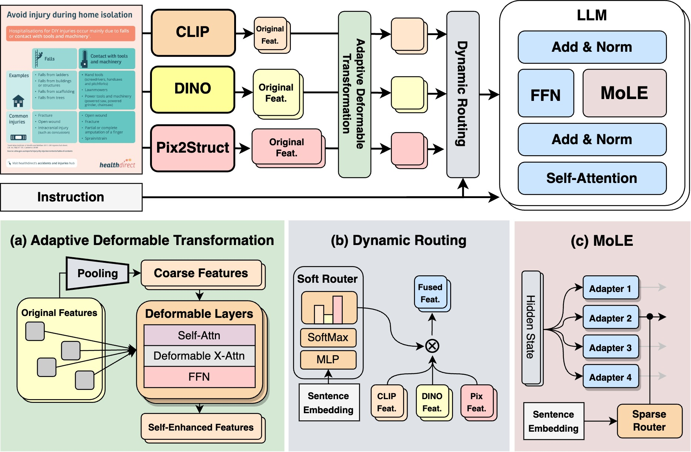
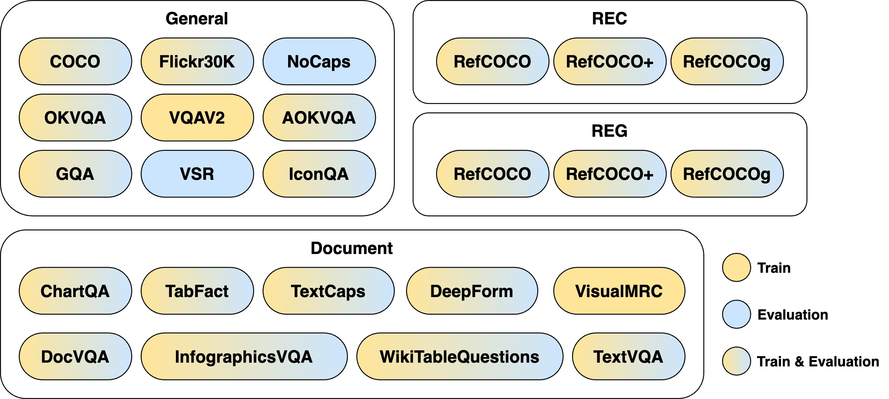
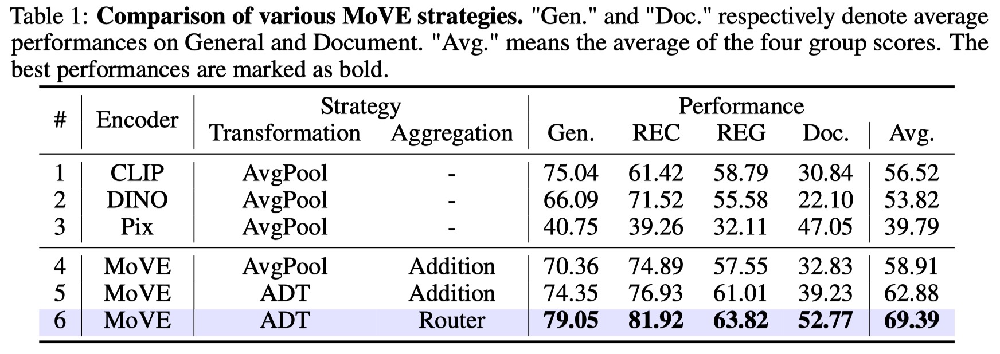
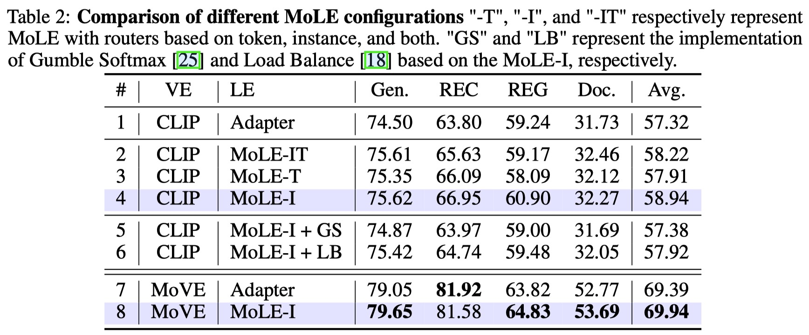
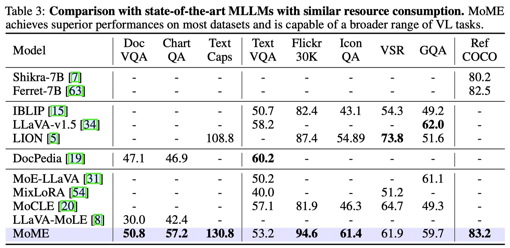
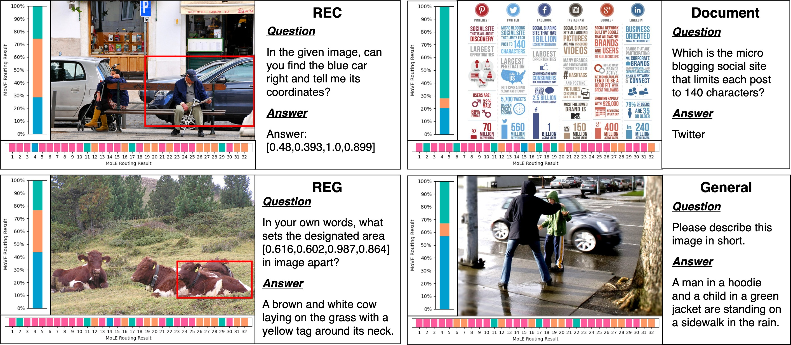

<div align="center">

<!-- <h1>JiuTian (九天) </h1> -->
<h2 class="papername"> MoME: Mixture of Multimodal Experts for Generalist Multimodal Large Language Models </h2>
<div>
<div>
    <a href="https://www.slywiki.cn/" target="_blank">Leyang Shen*</a>,
    <a href="https://scholar.google.com/citations?user=Mpg0w3cAAAAJ" target="_blank">Gongwei Chen*</a>,
    <a href="https://rshaojimmy.github.io/" target="_blank">Rui Shao†</a>,
    <a href="http://faculty.hitsz.edu.cn/guanweili" target="_blank">Weili Guan</a>,
    <a href="http://faculty.hitsz.edu.cn/guanweili" target="_blank">Liqiang Nie†</a>
</div>

School of Computer Science and Technology, Harbin Institute of Technology, Shenzhen<br>
*Equal contribution
†Corresponding author

[[Paper]](https://arxiv.org/abs/2407.12709)

:fire: Details will be released. Stay tuned :beers: :+1: 

[](https://hits.seeyoufarm.com)

</div>
<br>

</div>

## If you find this work useful for your research, please kindly cite our paper and star our repo.

## Updates
- [07/2024] [Arxiv paper](https://arxiv.org/abs/2407.12709) released.

## Introduction

This is the github repository of *MoME: Mixture of Multimodal Experts for Generalist Multimodal Large Language Models*. In this work, we propose a mixture of multimodal experts (MoME) to mitigate task interference and obtain a generalist MLLM.

Our MoME is composed of two key components, a mixture of vision experts (MoVE) and a mixture of language experts (MoLE). MoVE can adaptively modulate the features transformed from various vision encoders, and has a strong compatibility in transformation architecture. MoLE incorporates sparsely gated experts into LLMs to achieve painless improvements with roughly unchanged inference costs.

The architecture of the proposed MoME model:

<div align="center">

</div>

## Multitasking Benchmark

We collected 24 datasets and categorized them into four groups for instruction-tuning and evaluation:

<div align="center">

</div>

## Evaluation results

Here we list the multitasking performance comparison of MoME and baselines. Please refer to our paper for more details.





## Qualitative Examples


## Citation

If you find this work useful for your research, please kindly cite our paper:
```
@article{shen2024mome,
    title={MoME: Mixture of Multimodal Experts for Generalist Multimodal Large Language Models}, 
    author={Shen, Leyang and Chen, Gongwei and Shao, Rui and Guan, Weili and Nie, Liqiang},
    journal={arXiv preprint arXiv:2407.12709},
    year={2024}
}
```
